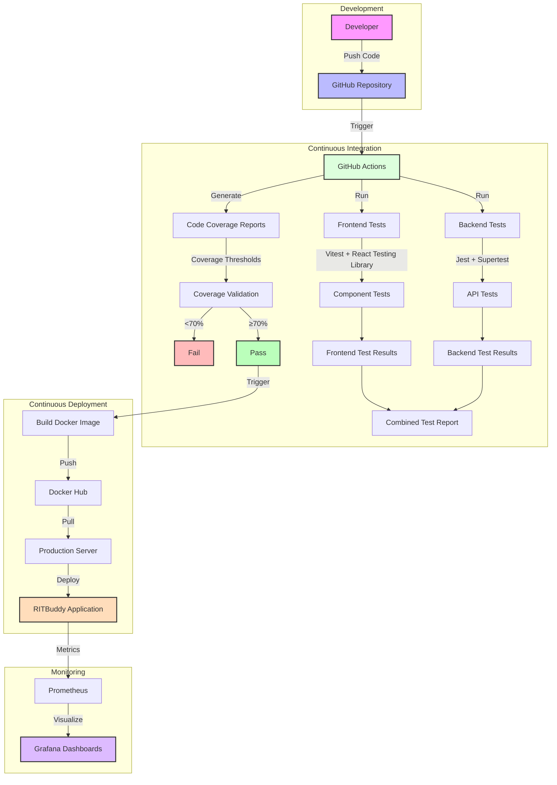

# RITBuddy CI/CD Architecture



## CI/CD Components Explanation

### 1. Development
- **Developers** work on local environments and push code to the GitHub repository
- Code changes trigger the CI/CD pipeline

### 2. Continuous Integration
- **GitHub Actions** orchestrates the CI workflow
- **Backend Tests** using Jest with Supertest
  - Located in `TempBackend/__tests__/`
  - Tests API endpoints like `/api/ask` and `/api/history`
- **Frontend Tests** using Vitest with React Testing Library
  - Located in `Frontend/src/__tests__/`
  - Tests components like ChatContainer and InputSection
- **Code Coverage** reports generated for both frontend and backend
  - Coverage thresholds set to 70% for statements, branches, functions, and lines

### 3. Continuous Deployment
- Successful tests trigger the CD workflow
- **Docker Image** is built and pushed to Docker Hub
- **Production Server** pulls the latest image and deploys the application

### 4. Monitoring
- **Prometheus** collects metrics from the application
- **Grafana** visualizes the metrics in dashboards

## Implementation Details

### Current Implementation
- GitHub Actions workflows in `.github/workflows/`:
  - `main.yml` - CI workflow for backend and frontend setup
  - `cd.yml` - CD workflow for Docker image build and push

### Recommended Enhancements
1. **Add Test Execution** to CI workflow
   - Run backend tests with Jest
   - Run frontend tests with Vitest
   - Generate and publish code coverage reports

2. **Add Quality Gates**
   - Enforce code coverage thresholds
   - Add linting and code quality checks

3. **Enhance Deployment Process**
   - Add staging environment
   - Implement blue/green deployment
   - Add automated rollback capability

4. **Expand Monitoring**
   - Add application performance monitoring
   - Set up alerting for critical metrics
   - Implement logging infrastructure

## Implementation Plan

1. **Update CI Workflow** (`main.yml`)
   ```yaml
   # Add to existing workflow
   - name: Run Backend Tests
     working-directory: ./TempBackend
     run: npm test
     
   - name: Run Frontend Tests
     working-directory: ./Frontend
     run: npm test
     
   - name: Upload Coverage Reports
     uses: actions/upload-artifact@v3
     with:
       name: coverage-reports
       path: |
         ./TempBackend/coverage
         ./Frontend/coverage
   ```

2. **Enhance CD Workflow** (`cd.yml`)
   ```yaml
   # Add to existing workflow
   - name: Deploy to Production
     run: |
       # Add deployment steps here
       echo "Deploying to production server"
   
   - name: Verify Deployment
     run: |
       # Add verification steps here
       echo "Verifying deployment"
   ```

3. **Set Up Monitoring**
   - Already configured with Prometheus and Grafana
   - Enhance with application-specific metrics
